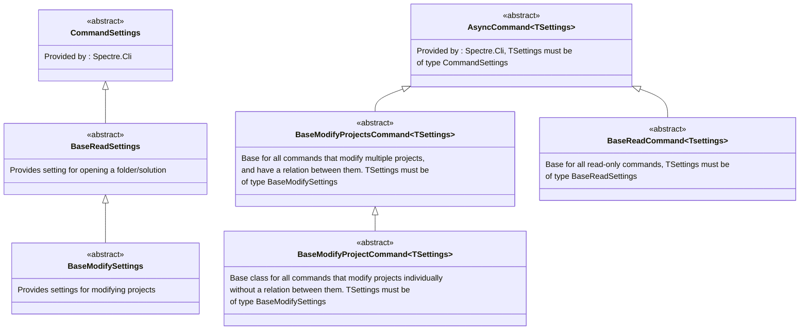

# Csproj architecture

## Commands structure

```mermaid
classDiagram
    CommandSettings <|-- BaseReadSettings
    BaseReadSettings <|-- BaseModifySettings

    AsyncCommand~TSettings~ <|-- BaseModifyProjectsCommand~TSettings~
    AsyncCommand~TSettings~ <|-- BaseReadCommand~Tsettings~ 
    BaseModifyProjectsCommand~TSettings~ <|-- BaseModifyProjectCommand~TSettings~

    class CommandSettings {
        <<abstract>>
        Provided by : Spectre.Cli
    }

    class BaseReadSettings {
        <<abstract>>
        Provides setting for opening a folder/solution
    }

    class BaseModifySettings {
        <<abstract>>
        Provides settings for modifying projects
    }

    class AsyncCommand~TSettings~ {
        <<abstract>>
        Provided by : Spectre.Cli, TSettings must be 
        of type CommandSettings
    }

    class BaseReadCommand~Tsettings~ {
        <<abstract>>
        Base for all read-only commands, TSettings must be
        of type BaseReadSettings
    }

    class BaseModifyProjectsCommand~TSettings~ {
        <<abstract>>
        Base for all commands that modify multiple projects,
        and have a relation between them. TSettings must be
        of type BaseModifySettings
    }

    class BaseModifyProjectCommand~TSettings~ {
        <<abstract>>
        Base class for all commands that modify projects individually
        without a relation between them. TSettings must be
        of type BaseModifySettings
    }
```